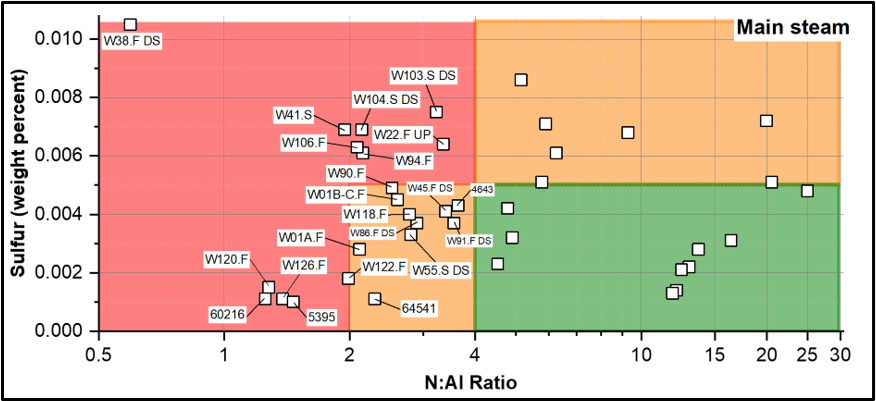
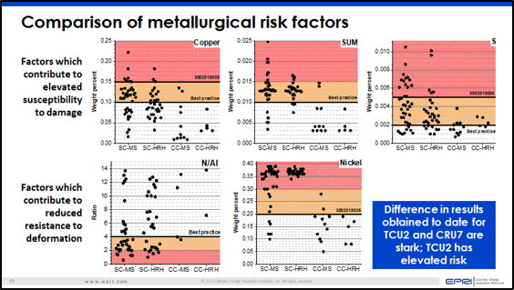

```{r setup, include=FALSE}
knitr::opts_chunk$set(echo = FALSE)
```

This project is really more like a set of projects combined into one, each tool doing a different job, but all of them useful to engineers. This post will go into detail about each tool in this toolbox.

## Grade 91 Tempering Tool
Grade 91 steel is often tempered before it is used in power plants to increase its quality of use. Tempering involved heating a metal to the “lower critical temperature” which causes the steel to become more ductile and less brittle in exchange of making it less hard. The purpose of this tool was to allow the user to input various factors of the steels tempering process to get a confidence interval of how much they could expect the steel’s hardness to reduce due to tempering. 


## Oxide Scale Calculator
One of the many factors that affects the materials used in power plants is called Oxide Scale. Pipes within these power plants funnel steam through them, and the oxygen in these pipes will react with the steel and produce an oxide scale layer. This oxide scale is to steel what rust is to iron. Luckily for us, this oxide scale is predictable, and as long as we know the temperature of the metal and how long it’s been in service, we can predict how thick the oxide scale layer will be. Even better, knowing any 2 of the 3 variables, oxide scale, metal temperature, and service duration, we can predict the third. This tool was designed to allow users to select what they want to calculate for and provide the other variables as inputs to get their answer.


## Metallurgical Risk Comparison
While steel is the main metal used in power plants for construction, not all steels are made equal, and most have trace amounts of various elements within their makeup. These elements affect the strength of the steel and can be the difference between risky designs and safe designs. EPRI did man experiment sand collected data on what elemental makeups were safe and how much was tolerable. This tool would allow the user to upload a csv or Excel workbook of the materials used in their designs and it would plot these materials along various graphs and show which materials presented a risk to the power plants design. 




## Creep Life Calculator
When materials are under pressure, they will deform. Imagine a bookcase with no books on it, the shelves would be very straight. But add several encyclopedias to the book shelf and you would see the shelf undergoes some deformation due to the initial strain of the added pressure. But once the initial deformation happened, as long as the shelf was strong enough to support the weight of the books, it would hold. However, when under constant stress, the shelf would continue to deform, ever so slightly, over long periods of time. This continued deformation over time is called creep, and as the material continues to deform it will get slightly weaker. Eventually, this material will reach the final stage, rupture, where it will break under the pressure. This tool is the result of EPRI’s research on various materials of different conditions (new, used, etc.) and applying constant pressures to them over the span of years. This tool plots the results of these experiments, and also allows the user to input the type of metal they are working with, its condition, and the pressures it is under to predict how long they can expect the material to last. 


